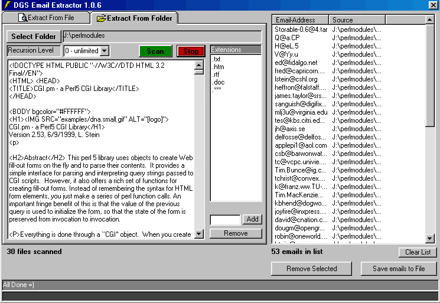



## File Email Extractor 1\.0\.6

### Description

Extracts valid email addresses (quickly) from local .txt,.rtf,.doc,.mdb,.xls,.zip files and more automatically removing duplicates.

Will scan entire drive recursively. Combine sort and edit and save list to several formats.

Uses single regular expression and recursive dir scanner class.

Please vote!!!

If you do not like this program return it, and keep the recursive directory scanner as my gift to you.

Added ini.bas so extention list is persistant.

Now recognizes .*** extension for all files.

Also added documentaion for dirscanner class.

Fixed a few bugs.

I will add resizing support soon.

Resizing code is lame, so I wrote a module to do it, but the module scales controls relatively to the form wich isn't as pretty as when it is hardcoded so controls are relative to each other.

I am working on an addin to do this, but I am new to addins. Any help would be greatly appreciated.
 
### More Info
 
Requires Microsoft scripting runtime

Requires Microsoft VBscript Regular Expresions 5.5

             |
---                |---
**Submitted On**   |2002-04-12 04:35:36
**By**             |[RegX](https://github.com/Planet-Source-Code/PSCIndex/blob/master/ByAuthor/regx.md)
**Level**          |Intermediate
**User Rating**    |5.0 (35 globes from 7 users)
**Compatibility**  |VB 6\.0
**Category**       |[Complete Applications](https://github.com/Planet-Source-Code/PSCIndex/blob/master/ByCategory/complete-applications__1-27.md)
**World**          |[Visual Basic](https://github.com/Planet-Source-Code/PSCIndex/blob/master/ByWorld/visual-basic.md)
**Archive File**   |[File\_Email713364122002\.zip](https://github.com/Planet-Source-Code/regx-file-email-extractor-1-0-6__1-33731/archive/master.zip)

